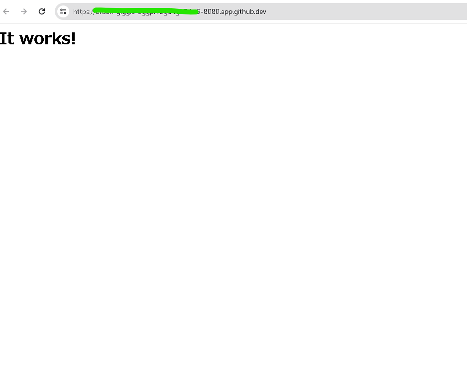

```bash
# dockerコンテナを作成、起動する
@RYA234 ➜   $ docker run --name apa000ex2 -d -p 8080:80 httpd
46dcdfed5e953d7239a4e4d345647b448bac70134f6b5017903cc9385f9fb45d

# dockerコンテナを停止する
@RYA234 ➜   $ docker stop apa000ex2
apa000ex2

# dockerコンテナを削除する
@RYA234 ➜   $ docker rm apa000ex2
apa000ex2

# dockerコンテナが削除されたことを確認する
@RYA234 ➜   $ docker ps -a
CONTAINER ID   IMAGE     COMMAND   CREATED   STATUS    PORTS     NAMES

```

確認した結果

